## Configure monsoon dashboards in Grafana
Grafana comes with several [dashboard templates](https://grafana.com/grafana/dashboards/) and configuration options, user can choose any of them or builda custom dashboard, Following is an example of configuration of Grafana dashboards one from template and one custom build.\
Monsoon deploys 2 targets on the SONiC host, first one [node_exporter](https://prometheus.io/docs/guides/node-exporter/) running on port 9100 and sonic_exporter is running on port 9101, both of these targets serves different matrices, In this example we configure a dashboards from template for node_exporter and a custom build dashboard for sonic_exporter.
  ### node_exporter dashboard
  There are many pre-built dashboard [templates available for node_exporter](https://grafana.com/grafana/dashboards/?search=Node+Exporter) in this example we are using [Node Exporter Full](https://grafana.com/grafana/dashboards/1860) template this can be imported in Grafana using it code 1860 as follows.
  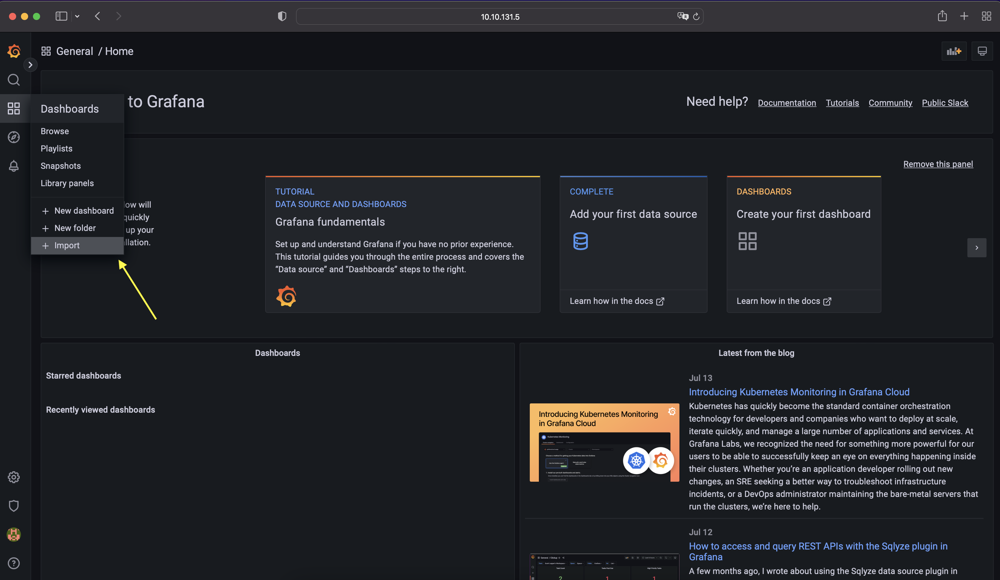
  
  Enter dashbord template code:
  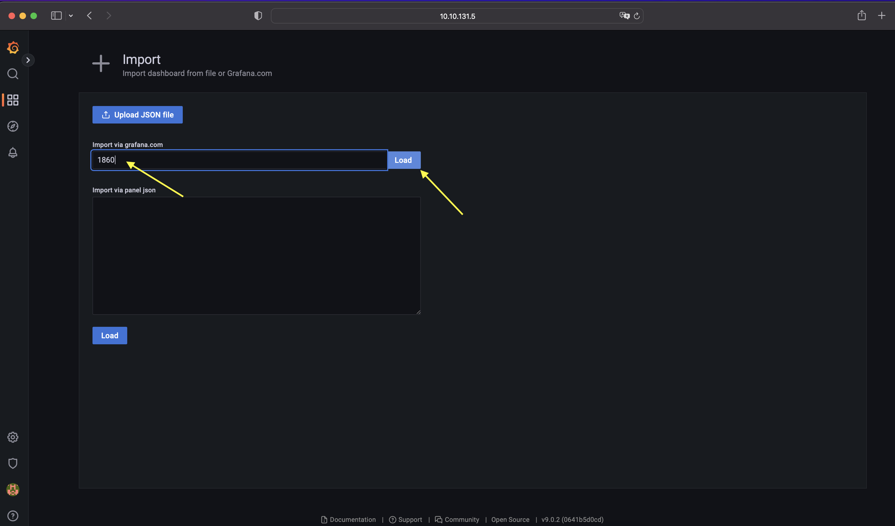
  
  Select Prometheus datasource :
  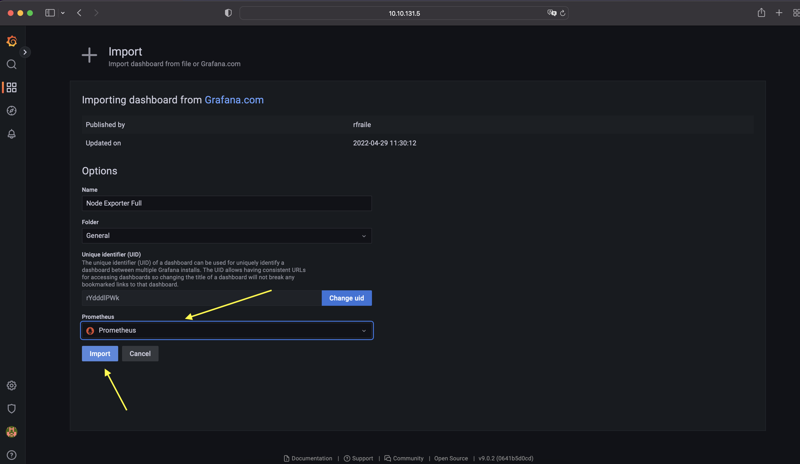

  After clicking import button, user will be redirected to dashboard automatically :
  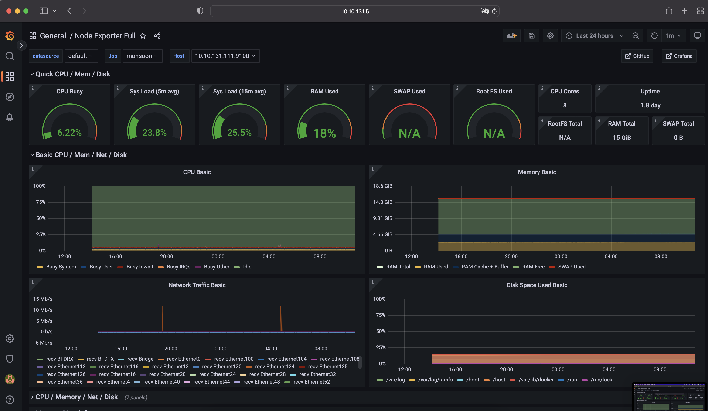

  ### sonic-exporter dashboard JSON
  Simplest is to import [this](config/sonic_exporter_grafana_dashboard.json) file in Grafana dashboard section. Otherwise, in the [section](#sonic-exporter-dashboard-manual-configuration) there is an example on how to configure a Grafana dashboard for sonic-exporter. 
  ### sonic-exporter dashboard manual configuration
  Currently sonic_exporter serves a number of metrices, those sonic specific metrices can be idetified in Grafana with prefix 'sonic'. Using those SONiC specific metrices user can create his own dashboard here is an example for a single metric 'sonic_interface_temperature_celsius':
  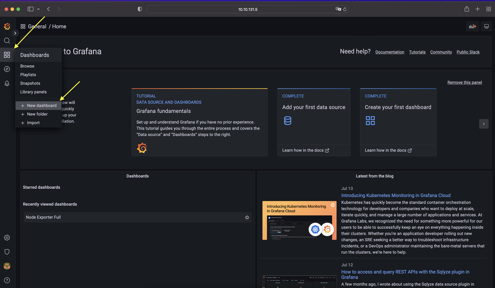

  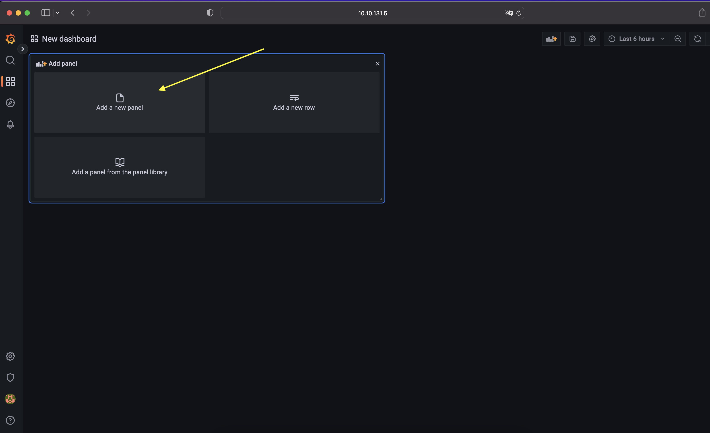

  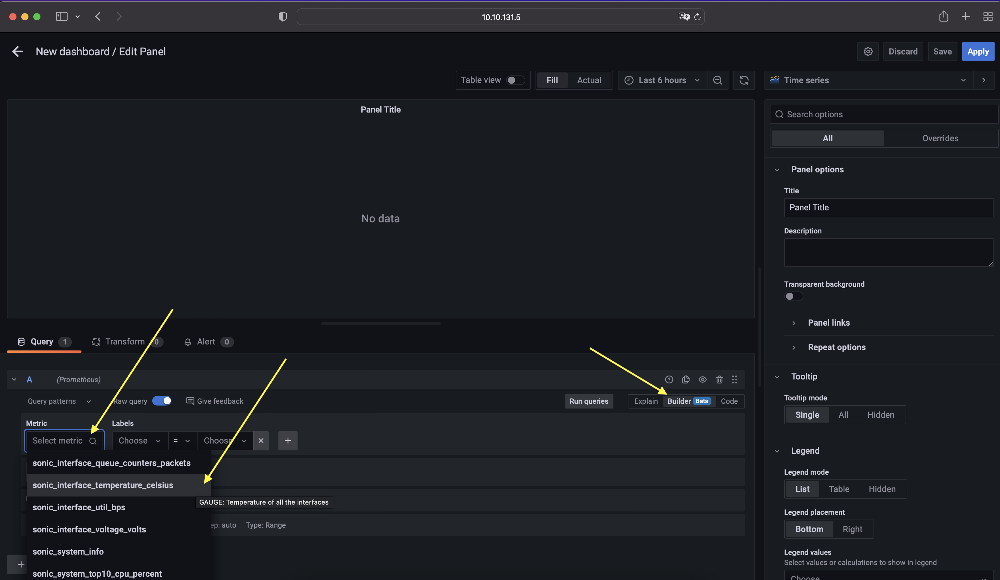

  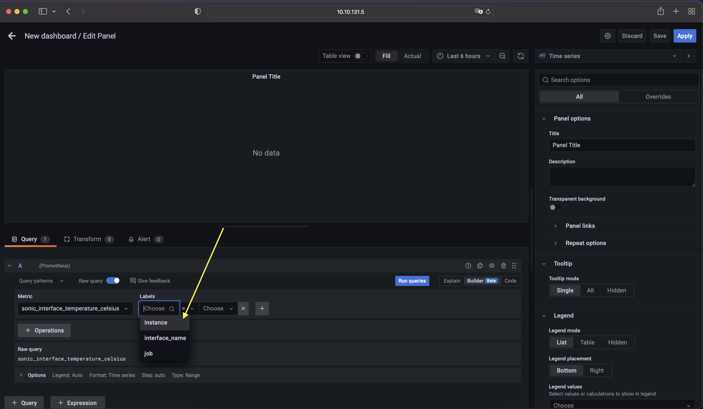

  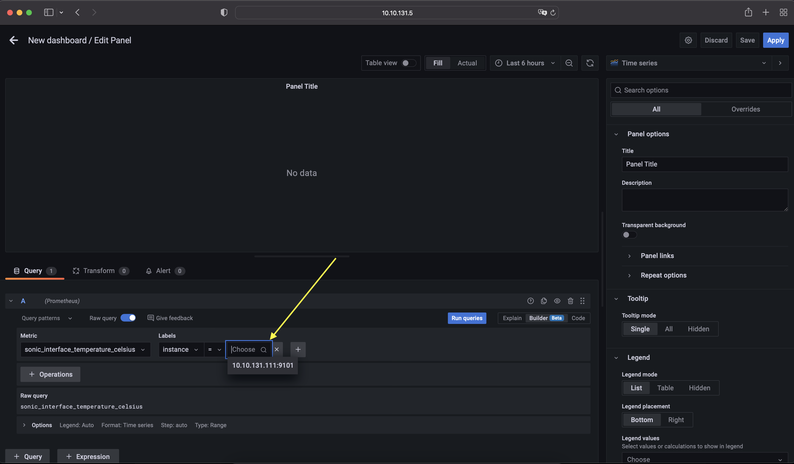

  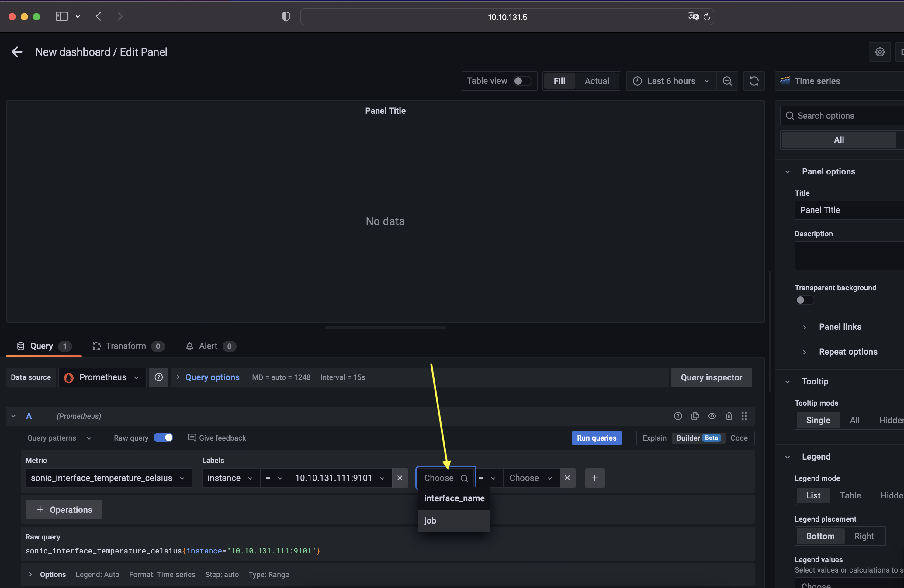

  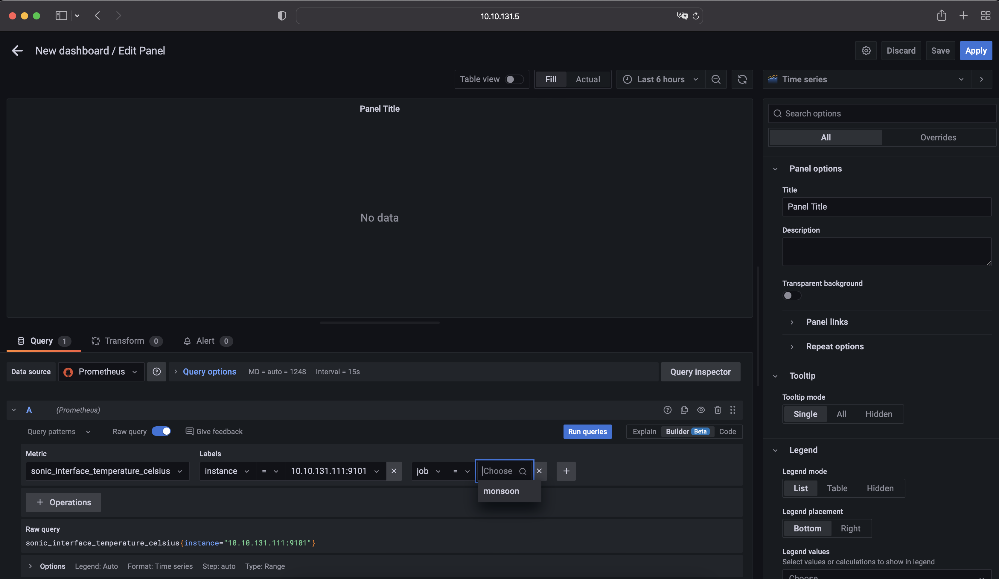

  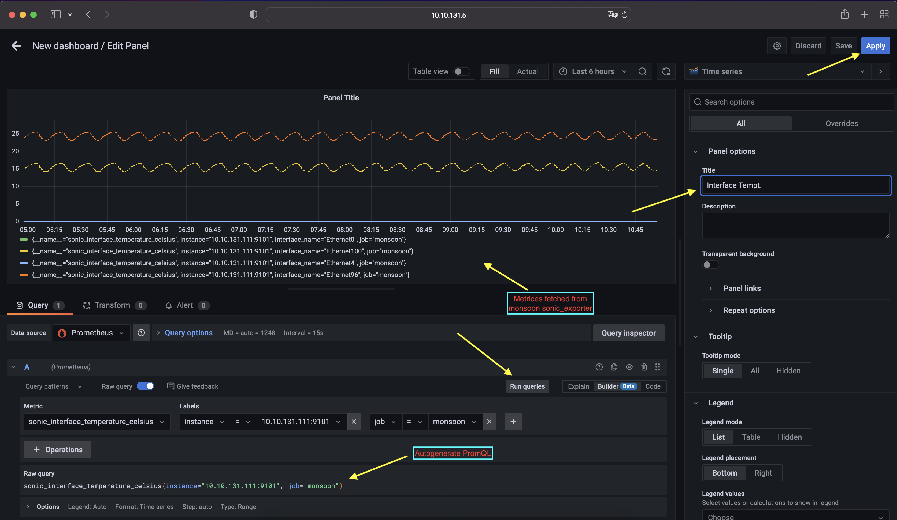

  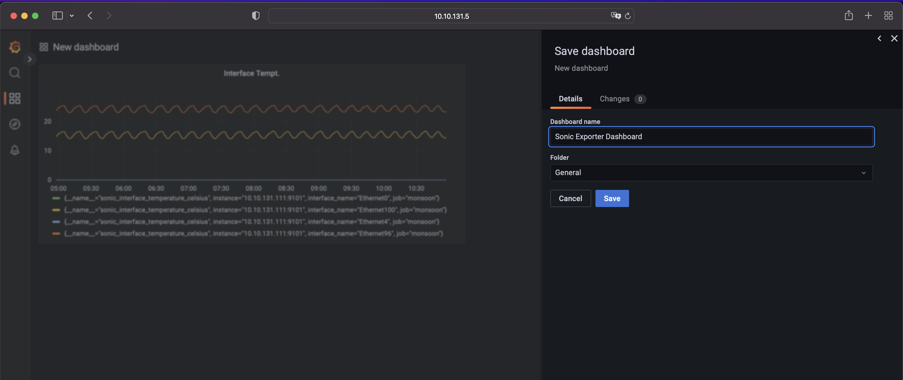

  
  
  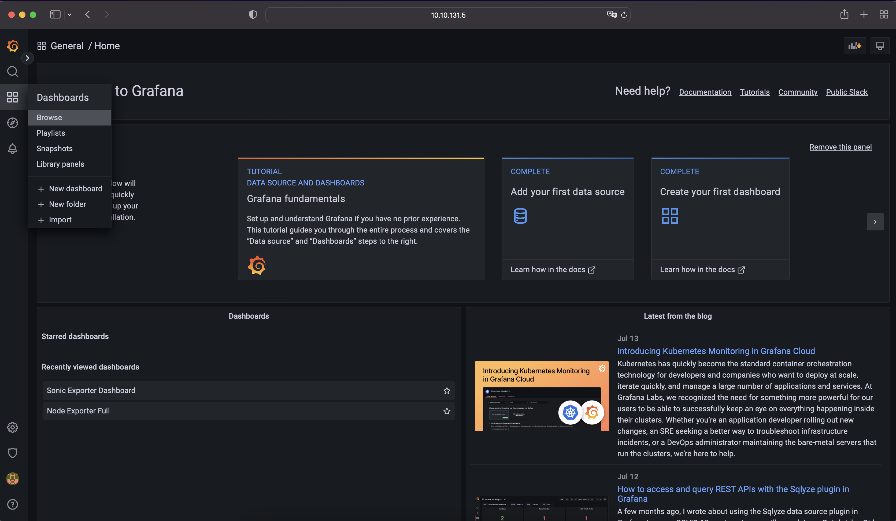

  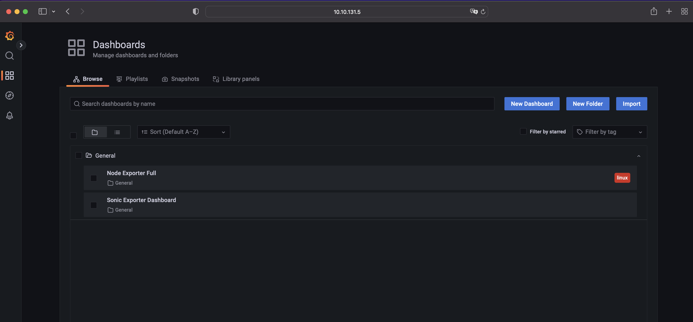
