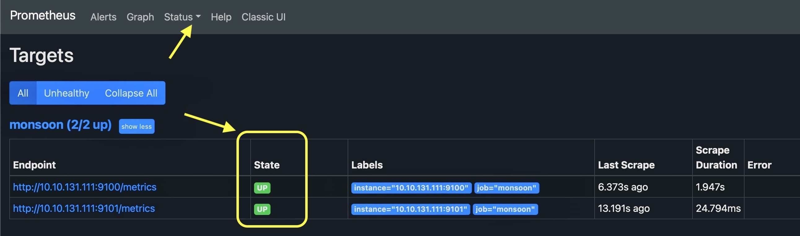
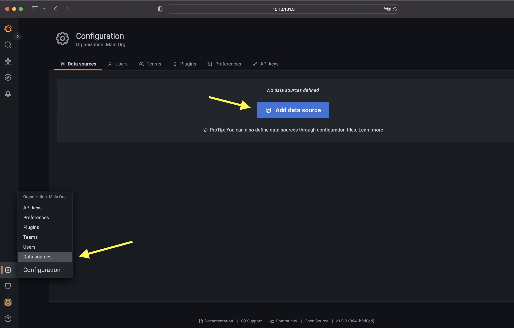
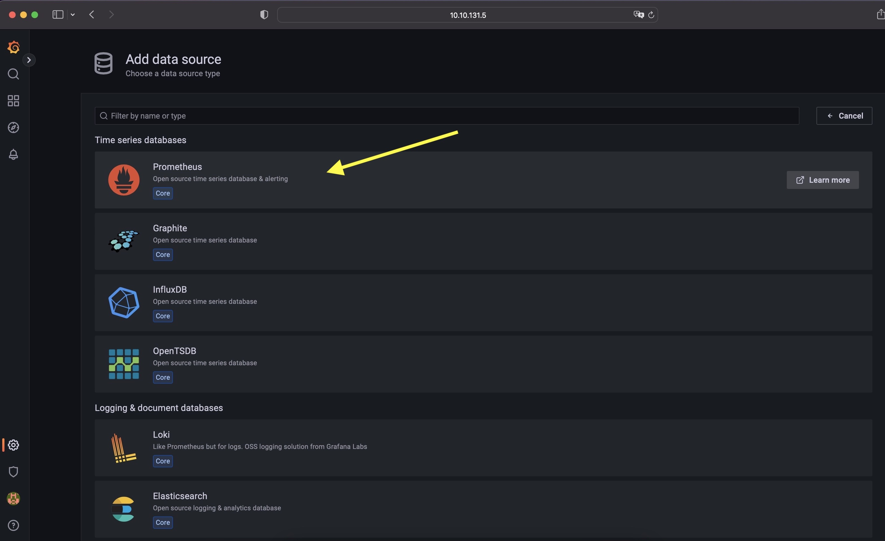
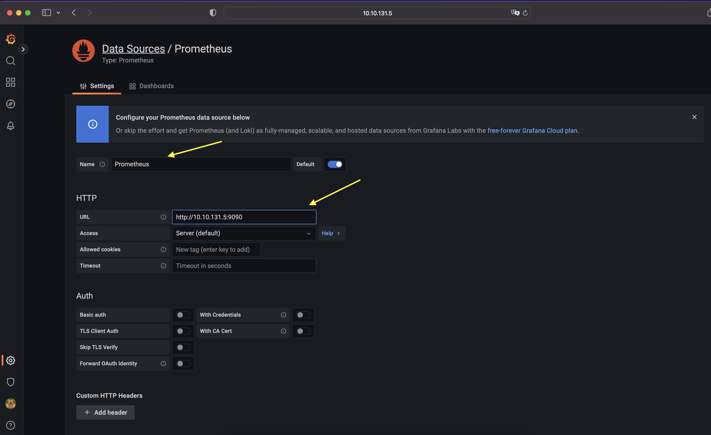
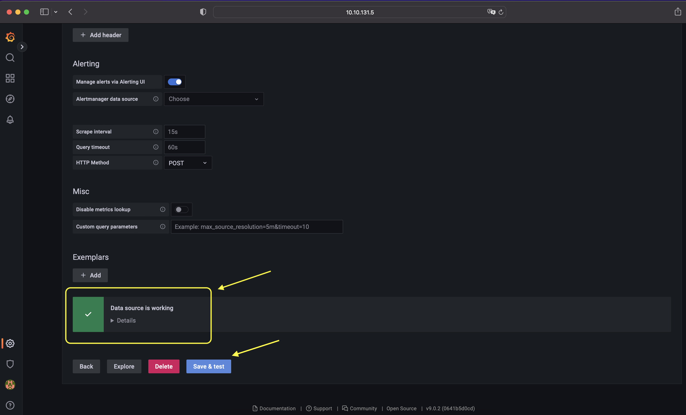

# Monsoon - A data visualization and monitoring solution for SONiC

Monsoon uses Prometheus and Grafana for data collection and visualization. Apart from using 'node_exporter' (standard data collector for prometheus client) Monsoon utilizes sonic-py-swsssdk to fetch data from SONiC DB to Prometheus

## Getting started 
- ### Install monsoon SONiC host
    To install monsoon execute following commands:
    ```
    git clone https://github.com/STORDIS/monsoon.git
    cd deploy
    sudo sh install.sh
    ```
  - #### Verify Monsoon installation:
      At this stage metrices data can already be accessed in raw text format at http://<sonic_host_ip>:9100/metrics and http://<sonic_host_ip>:9101/metrics

- ### Install Prometheus 
  Prometheus acts as a data collector tool for monsoon and supplies data for visualization (in the next step).
  It is reommended to install Prometheus on separate host i.e. Ubuntu_20.04 etc.
  Please check the path for prometheus config file ~/monsoon/config/prometheus.yml is correct, also replace the target IPs at the bottom in this file with your SONiC host. Then execute following :
  ```
  docker run -p 9090:9090 -v ~/monsoon/config/prometheus.yml:/etc/prometheus/prometheus.yml prom/prometheus
  ```

  Further details of Prometheus installation are [here](https://prometheus.io/docs/prometheus/latest/installation/).

  - #### Verify Prometheus Targets Status :
    Open Prometheus web console at http://prometheus_ip:9090 and check for target status under 'status' tab.  


- ### Install Grafana
  Grafana can be installed on same host as Prometheus but recommended is to install it on a separate host i.e. Ubuntu_20.04 etc. 
  On Debian/Ubuntu Grafana can be installed as follows :
  ```
  sudo apt-get install -y apt-transport-https
  sudo apt-get install -y software-properties-common wget
  wget -q -O - https://packages.grafana.com/gpg.key | sudo apt-key add -
  echo "deb https://packages.grafana.com/oss/deb stable main" | sudo tee -a /etc/apt/sources.list.d/grafana.list
  sudo apt-get update
  sudo apt-get install grafana
  ```

  Further details of Grafana installation are [here](https://grafana.com/docs/grafana/latest/setup-grafana/installation/).
  - #### Verify Grafana Installation
    Grafana web console can be accessed at http://grafan_host_ip:3000 and login with default credentials admin/admin. 
  - #### Add data source to Grafana
    Login to Grafana portal http://grafana_host_ip:3030 , Then :
    
    
    
    

  - By step all tool chain is connected. Next its time to data visualization, please check [how to configure grafana dashboards](GrafanaDashBoard.md).

