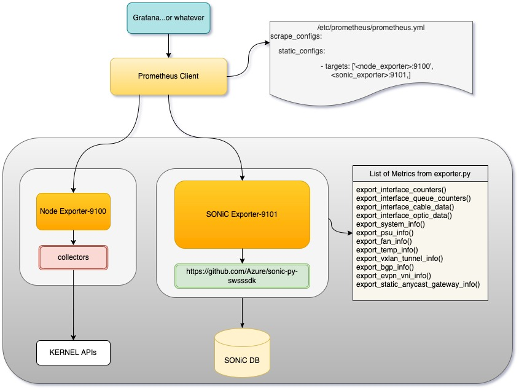
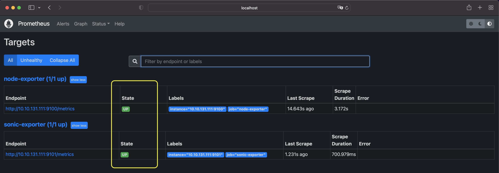

# Monsoon - A data visualization and monitoring solution for SONiC

Try [Live Demo](http://monsoon.stordis.com:8080).

Monsoon uses Prometheus and Grafana for data collection and visualization. Apart from using 'node_exporter' (standard data collector for prometheus client) Monsoon uses sonic-exporter to fetch data from SONiC DB to Prometheus and Grafana.

* [Monsoon Design](#monsoon-design-monsoon-designimagesmonsoonjpg)
* [Getting started with monsoon](#getting-started-with-monsoon)
  * [Install sonic-exporter](#install-sonic-exporter)
  * [Install node-exporter](#install-node-exporter)
  * [Install Prometheus](#install-prometheus)
  * [Install Grafana](#install-grafana)
* [Build from source](#build-sonic-exporter-docker-image-from-source)
* [Client certificate generation](#securing-sonic-exporter-and-node-exporter-with-central-client-certificate-generation)
  
## Monsoon Design 
A high level monsoon design is as follows, various components are explained in further sections.


## Getting started with monsoon
  There are 4 major components of monsoon project- sonic-exporter, node-exporter, Prometheus, Grafana.
- ### Install sonic-exporter
    sonic-exporter component is developed as one of the parts of monsoon project which utilizes sonic-py-swsssdk APIs, To install sonic-exporter execute following commands:
  - #### Get the sonic-exporter docker image (only when SONiC switch is not connected to internet else go to next step and start sonic-exporter)
    
    If your switch is not connected to internet, then on any of your host connected to internet do following :
    ```
    docker pull stordis/sonic-exporter
    docker save stordis/sonic-exporter | gzip > sonic-exporter.tar.gz
    scp sonic-exporter.tar.gz admin@<switch_ip>:
    ssh admin@<switch_ip> "docker load -i sonic-exporter.tar.gz"
    ```
  - #### Start sonic-exporter container
    Execute following command on SONiC host to start sonic-exporter container :
    ```
    docker run -e SONIC_EXPORTER_ADDRESS="" --name sonic-exporter --network=host --pid=host --privileged --restart=always -d -v /var/run/redis:/var/run/redis -v /usr/bin/vtysh:/usr/bin/vtysh -v /usr/bin/docker:/usr/bin/docker -v /var/run/docker.sock:/var/run/docker.sock stordis/sonic-exporter:main
    ```

  - #### Verify sonic-exporter installation:
      Metrices from sonic-exporter should be available in raw text format ``` curl "http://sonic_switch_ip:9101/metrics" ```

- ### Install node-exporter
  node-exporter is standard module of prometheus, node exporter can be started as follows: 
  - #### Get the node-exporter docker image (only when SONiC switch is not connected to internet else go to next step and start node-exporter)
    If your switch is connected to internet :
    ```
    docker pull prom/node-exporter:v1.3.1
    ```
    If your switch is not connected to internet, then on any of your host connected to internet do following :
    ```
    docker pull prom/node-exporter:v1.3.1
    docker save prom/node-exporter:v1.3.1 | gzip > node-exporter_v1.3.1.tar.gz
    scp node-exporter_v1.3.1.tar.gz admin@<switch_ip>:
    ssh admin@<switch_ip> "docker load -i node-exporter_v1.3.1.tar.gz"
    ```
  - #### Start node-exporter container on SONiC switch
    ```
    docker run --name node-exporter --network=host --pid=host --privileged --restart=always -d -v /proc:/host/proc:ro -v /sys:/host/sys:ro -v /:/rootfs:ro prom/node-exporter:v1.3.1 --path.rootfs=/host --no-collector.fibrechannel --no-collector.infiniband --no-collector.ipvs --no-collector.mdadm --no-collector.nfs --no-collector.nfsd --no-collector.nvme --no-collector.os --no-collector.pressure --no-collector.tapestats --no-collector.zfs --no-collector.netstat --no-collector.arp
    ```
  - #### Verify node-exporter installation 
    Metrices from node-exporter should be available in raw text format with following:
    ``` 
    curl "http://<sonic_switch_ip>:9100/metrics" 
    ```

- ### Install Prometheus 
  Prometheus acts as a data collector tool for monsoon and supplies data for visualization in Grafana (in the next step).
  It is reommended to install Prometheus on separate host i.e. Ubuntu_20.04 etc.
  Config file ~/monsoon/config/prometheus.yml can be used for prometheus installation, also replace the exporter IPs at the bottom in this file with your SONiC switch. Then execute following :
  ```
  docker run -d -p 9090:9090 -v ~/monsoon/config/prometheus.yml:/etc/prometheus/prometheus.yml prom/prometheus:v2.37.0
  ```
  Further details of Prometheus installation are [here](https://prometheus.io/docs/prometheus/latest/installation/).

  - #### Verify Prometheus Targets Status :
    Open Prometheus web console at http://prometheus_ip:9090 and check for target status under 'status' tab.  


- ### Install Grafana
  Grafana is a configurable data visulization tool, In opur case it help to visualize data fetched from prometheus (in step above). Grafana can be installed on same host as Prometheus but recommended is to install it on a separate host i.e. Ubuntu_20.04 etc. 
  On Debian/Ubuntu Grafana container can be started as follows : 
  ```
  docker run -d -p 3000:3000 --name grafana grafana/grafana-oss:9.0.6
  ```
  Further details to run Grafana container are [here](https://grafana.com/docs/grafana/latest/setup-grafana/installation/docker/).
  - #### Verify Grafana Installation
    Grafana web console can be accessed at http://grafan_host_ip:3000 and login with default credentials admin/admin. 
  - #### Add data source to Grafana
    Login to Grafana portal http://grafana_host_ip:3030 , Then :
    
    
    
    

  - By this step all tool chain is connected. Next, [Configure Grafana dashboard and data visualization](GrafanaDashBoard.md).

## Build sonic-exporter docker image from source
>**NOTE**-As our [Dockerfile](Dockerfile) is multistage, The first part of docker build command below creates an intermediate image with specific tag and makes it easy to understand also single intermediate image is created every time otherwise user may find multiple intermediate images with the tag `<none>` and mixing this with dangling images.\
Alternative could be to execute `docker image prune -f` after the sonic-exporter docker image is built but be carefull, doing this will remove every unsed docker images on your machine.

To build sonic-exporter docker image execute following : \
`git clone --recurse-submodules git@github.com:STORDIS/monsoon.git`\
`docker build --target builder -t intermediate:latest . && docker build -t sonic-exporter:latest .`
- Get a docker image archieve :\
`docker save -o sonic-exporter_latest.tar.gz sonic-exporter:latest`\
To install image on switch, copy sonic-exporter_latest.tar.gz to switch and on switch execute :\
`docker load -i sonic-exporter_latest.tar.gz`\
And run the container with the command given in the [section](#start-sonic-exporter-container) above. Please mind changing the version of image in the command.
- (Optional) Push docker image to docker hub :\
`docker tag <sonic_exporter_img_id> <repository_name at hub.docker.com>/sonic-exporter:latest`\
`docker push <repository_name at hub.docker.com>/sonic-exporter:latest`

## Securing sonic-exporter and node-exporter with Central Client Certificate Generation

This generated client key should be encrypted with sops and put into git.

Environments
- ref
- prd

You will need this `client.crt` on all switches you want to collect data from.

```bash
#! /usr/bin/env bash
# Get the cert_config_template from the git repository
# 
export CERT_CONFIG=$(mktemp)
cat cert.config.template | HOSTNAME=$(hostname --fqdn) envsubst > ${CERT_CONFIG}
openssl req -newkey rsa:4096 -x509 -sha256 -days 3650 -nodes -out client.crt -keyout client.key -config ${CERT_CONFIG}
rm "${CERT_CONFIG}"
```

## Preparation

Loading the images from Upstream and copying them to the switch.


```bash
#! /usr/bin/env bash
export SWITCH="switch_hostname"

## This sections is also relevant on the switch
export NODE_EXPORTER_VERSION=1.3.1
export NODE_EXPORTER_IMAGE="prom/node-exporter:v${NODE_EXPORTER_VERSION}"
export NODE_EXPORTER_FILE="prom_node-exporter_${NODE_EXPORTER_VERSION}.tar.gz"

export NGINX_VERSION=1.21.6
export NGINX_IMAGE="nginx:${NGINX_VERSION}"
export NGINX_FILE="nginx_${NGINX_VERSION}.tar.gz"

export SONIC_EXPORTER_VERSION=0.2.1
export SONIC_EXPORTER_IMAGE="stordis/sonic-exporter:${SONIC_EXPORTER_VERSION}"
export SONIC_EXPORTER_FILE="sonic-exporter_${SONIC_EXPORTER_VERSION}.tar.gz"


docker pull ${NODE_EXPORTER_IMAGE}
docker pull ${NGINX_IMAGE}
docker pull ${SONIC_EXPORTER_IMAGE}

docker save "${NODE_EXPORTER_IMAGE}" | gzip > "${NODE_EXPORTER_FILE}"
docker save "${NGINX_IMAGE}" | gzip > "${NGINX_FILE}"
docker save "${SONIC_EXPORTER_IMAGE}" | gzip > "${SONIC_EXPORTER_FILE}"

scp ${NODE_EXPORTER_FILE} "admin@${SWITCH}:"
scp ${NGINX_FILE} "admin@${SWITCH}:"
scp ${SONIC_EXPORTER_FILE} "admin@${SWITCH}:"

scp default.conf.template "admin@${SWITCH}:"
scp cert.config.template "admin@${SWITCH}:"
scp client.crt "admin@${SWITCH}:"

ssh "admin@${SWITCH}" "docker load -i ${NODE_EXPORTER_FILE}"
ssh "admin@${SWITCH}" "docker load -i ${NGINX_FILE}"
ssh "admin@${SWITCH}" "docker load -i ${SONIC_EXPORTER_FILE}"

```
## Installation

1. SONIC exporter

```console
$ docker run --name sonic-exporter --network=host --pid=host --privileged --restart=always -d -v /var/run/redis:/var/run/redis -v /usr/bin/vtysh:/usr/bin/vtysh -v /usr/bin/docker:/usr/bin/docker -v /var/run/docker.sock:/var/run/docker.sock  ${SONIC_EXPORTER_IMAGE}
```

2. Node Exporter
```console
$ docker run --name node-exporter --network=host --pid=host --privileged --restart=always -d -v /proc:/host/proc:ro -v /sys:/host/sys:ro -v /:/rootfs:ro ${NODE_EXPORTER_IMAGE} --path.rootfs=/host --no-collector.fibrechannel --no-collector.infiniband --no-collector.ipvs --no-collector.mdadm --no-collector.nfs --no-collector.nfsd --no-collector.nvme --no-collector.os --no-collector.pressure --no-collector.tapestats --no-collector.zfs --no-collector.netstat --no-collector.arp --web.listen-address=localhost:9100
```

3. Nginx Proxy
```bash
#! /usr/bin/env bash
mkdir -p ${HOME}/nginx/ssl
cp ${HOME}/default.conf.template ${HOME}/nginx/default.conf.template
cp ${HOME}/client.crt ${HOME}/nginx/ssl/client.crt
export CERT_CONFIG=$(mktemp)
openssl dhparam -dsaparam -out ${HOME}/nginx/ssl/dhparam.pem 4096
cat cert.config.template | HOSTNAME=$(hostname --fqdn) envsubst > ${CERT_CONFIG}
openssl req -newkey rsa:4096 -x509 -sha256 -days 3650 -nodes -out ${HOME}/nginx/ssl/server_$(hostname --fqdn).crt -keyout ${HOME}/nginx/ssl/server_$(hostname --fqdn).key -config ${CERT_CONFIG}
rm ${CERT_CONFIG}
```

```console
$ docker run --name nginx-proxy --network=host --pid=host --privileged --restart=always -d -e DOLLAR_SIGN='$' -e NGINX_HOST=$(hostname --fqdn) -e NGINX_PORT=5556 -v ${HOME}/nginx/ssl:/etc/nginx/ssl/:ro -v ${HOME}/nginx/default.conf.template:/etc/nginx/templates/default.conf.template:ro ${NGINX_IMAGE}
```

## Verifying Installation works

```bash
#!/usr/bin/env bash
curl --cert client.crt --key client.key -k "https://${SWITCH}:5556/node/metrics"
```
## Details:

1. src/ folder has below subfolders
- sonic_exporter - this folder contains - exporter script
- sonic-py-swsssdk - this is a git submodule pulled from [github](https://github.com/Azure/sonic-py-swsssdk) as a redis connector used by python_exporter.

2. Dockerfile - This file can be used to build docker image.


## Environment Variables

| VARIABLE                  | Description                                                           | Default           |
| ------------------------- | --------------------------------------------------------------------- | ----------------- |
| DEVELOPER_MODE            | This enables the Mock functionality of the exporter for local testing | `False`           |
| REDIS_COLLECTION_INTERVAL | The interval in which the redis-client fetches data from the switch   | `30` (in seconds) |
| SONIC_EXPORTER_PORT       | The port on which the exporter listens                                | `9101`            |
| SONIC_EXPORTER_ADDRESS    | The address on which the exporter listens                             | `localhost`       |
| SONIC_EXPORTER_LOGLEVEL   | The loglevel for the exporter                                         | `INFO`            |

## Get Mock Data

Copy the `get_new_data_from_switch.sh` onto the switch you want to collect data from.

```bash
export SWITCH="switch.example.com"
scp get_new_data_from_switch.sh ${SWITCH}:
ssh ${SWITCH}
bash get_new_data_from_switch.sh
```

To get HWMON mock data you need to build first the container in Building.
Then run it on the switch.
After doing it exec into the container.

```bash
docker exec -ti sonic-exporter bash
python /usr/local/lib/python${PYTHON_VERSION%.*}/site-packages/sonic_exporter/sys_class_hwmon.py
```


## Building

```console
$ export VERSION="main"
$ docker build -t sonic-exporter:${VERSION} .
[1/2] STEP 1/7: FROM python:3.10-bullseye
Resolving "python" using unqualified-search registries (/etc/containers/registries.conf)
Trying to pull docker.io/library/python:3.10-bullseye...
Getting image source signatures
Copying blob 461bb1d8c517 done  
Copying blob 724cfd2dc19b done  
Copying blob e6d3e61f7a50 done  
Copying blob 412caad352a3 done  
Copying blob 808edda3c2e8 done  
Copying blob 0c6b8ff8c37e done  
Copying blob 8bd4965a24ab done  
Copying blob fccd5fa208a8 done  
Copying blob af1ca64a0eec done  
Copying config e2e732b795 done  
Writing manifest to image destination
Storing signatures
[1/2] STEP 2/7: COPY . .
--> b1bb5809caf
[1/2] STEP 3/7: RUN pip3 install poetry
--> 1f58ca76511
[1/2] STEP 4/7: RUN poetry export -f requirements.txt -o /home/requirements.txt
--> aafc87b688d
[1/2] STEP 5/7: RUN cd src/sonic-py-swsssdk && python setup.py build sdist && cd ../..
--> b056c2dad7e
[1/2] STEP 6/7: RUN poetry build
--> 7a0b271d272
[1/2] STEP 7/7: RUN cp dist/sonic_exporter*.tar.gz /home/ && cp src/sonic-py-swsssdk/dist/swsssdk-*.tar.gz /home
--> c1af04863c0
[2/2] STEP 1/5: FROM python:3.10-slim-bullseye
[2/2] STEP 2/5: COPY --from=0 /home/requirements.txt /home/requirements.txt
--> 9d98422dfc2
[2/2] STEP 3/5: COPY --from=0 /home/*.tar.gz /home/
--> bfdf47151b8
[2/2] STEP 4/5: RUN pip3 install --pre -r /home/requirements.txt && pip3 install /home/*.tar.gz && mkdir -p /src
--> a9de129245a
[2/2] STEP 5/5: CMD sonic_exporter
[2/2] COMMIT sonic-exporter:${VERSION}
--> f71e7b8de82
Successfully tagged localhost/sonic-exporter:${VERSION}
f71e7b8de82e5eabfe66c803538f19d1fb3c44b3b0edf9725e9eb61943d4a093
$ docker save --format docker-archive localhost/sonic-exporter:${VERSION} | gzip  > sonic-exporter_${VERSION}.tar.gz
$ ls
sonic-exporter_${VERSION}.tar.gz
```

## Loading the image on a switch

```console
$ docker load -i sonic-exporter_${VERSION}.tar.gz
e1bbcf243d0e: Loading layer  83.88MB/83.88MB
7944c75516ae: Loading layer  3.401MB/3.401MB
775d27396430: Loading layer  30.41MB/30.41MB
70c19fb3395a: Loading layer  4.608kB/4.608kB
834714e112d6: Loading layer  10.09MB/10.09MB
6062c6897570: Loading layer  3.584kB/3.584kB
c7e4a0cae15f: Loading layer  36.35kB/36.35kB
2d345aa4239f: Loading layer   10.3MB/10.3MB
Loaded image: localhost/sonic-exporter:${VERSION}
```

